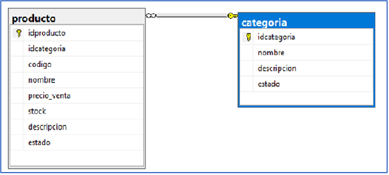
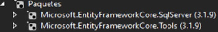

# ASPNetCore_&_EFC_DBFirst
Base de datos existentes DBFirst

## Enfoque Database First
```
Este enfoque se usa cuando la base de datos esta lista, luego Entity Framework completara su deber y creara las entidades.
Si ya tiene una base de datos diseñada y no desea hacer un esfuerzo adicional, puede seguir este enfoque.
Puede modificar la base de datos manualmente y actualizar el modelo desde la base de datos.
Por lo tanto, podemos decir que Entity Framework puede crear sus clases de modelo basadas en tablas y columnas de la base de datos relacional.
```

## Creación de la base de datos dbproductos, la relación es de Uno a Muchos:
- `1 Categoría puede tener Mucho Productos`


## Instalacion Entity Framework Core
Instalacion del paquete `Microsoft.EntityFrameworkCore.SqlServer`


Instalacion del paquete `Microsoft.EntityFrameworkCore.Tools`


Desde la carpeta dependencias se ven los 2 paquetes instalados.


## Ingeniería Inversa para crear el Modelo de datos
Teniendo la base de datos creada, se genera todos los modelos utilizando `EntityFrameworkCore`.

Desde la consola **Nuget Package Manager**


Se ingresa el siguiente comando en la consola:
> Scaffold-DbContext 'Data Source=**(localdb)\MyInstance**;Initial Catalog=**dbproductos**' Microsoft.EntityFrameworkCore.SqlServer -**OutputDir Models**

Se generan los modelos **Categorías** y **Producto** la carpeta **Models**. Y se crea el **DBContext** llamado `dbproductosContext`.


## Registro del contexto con Inyección de Dependencias
ASP.NET Core implementa la **inyección de dependencia** de forma predeterminada. Los
servicios (como el contexto de la base de datos EF) se registran con la inyección de
dependencia durante el inicio de la aplicación. Los componentes que requieren estos
servicios (como los controladores MVC) se proporcionan a través de parámetros de
constructor.

Se agrega la cadena de conexión de la BD, en el archivo **appsettings.json**
  `"ConnectionStrings": {
    "DefaultConnection": "Data Source=(localdb)\\MyInstance;Initial Catalog=dbproductosCodeFirst"
  },`

El contexto de la base de datos **dbproductosContext** se registró como un servicio
en **Startup.cs**, en el metodo `ConfigureServices()`.

> De esta manera se hace la **Inyección de Dependencias**.

## Crear el Controlador y las Vistas utilizando Scaffolding
Desde la carpeta **Controllers**, seleccionar el menú Add -> Controller, la siguiente plantilla:


Seleccionar Clase de Modelos y Contexto de datos.


Se genera el controlador y la carpeta Categorías en la carpeta View, para realizar el CRUD.


Carpeta Views


